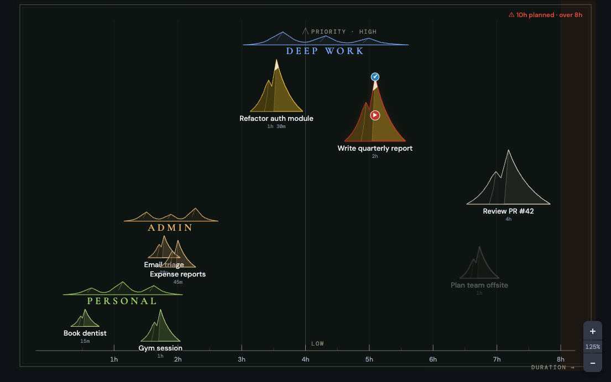
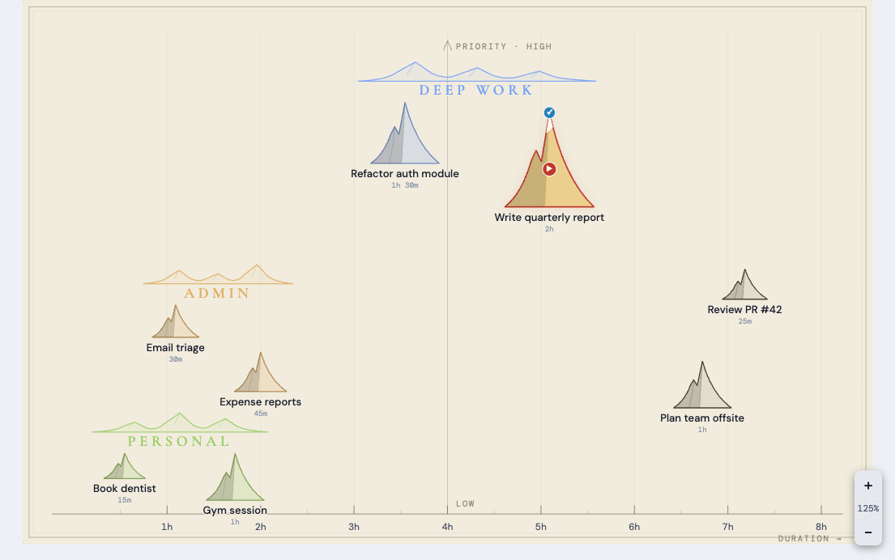
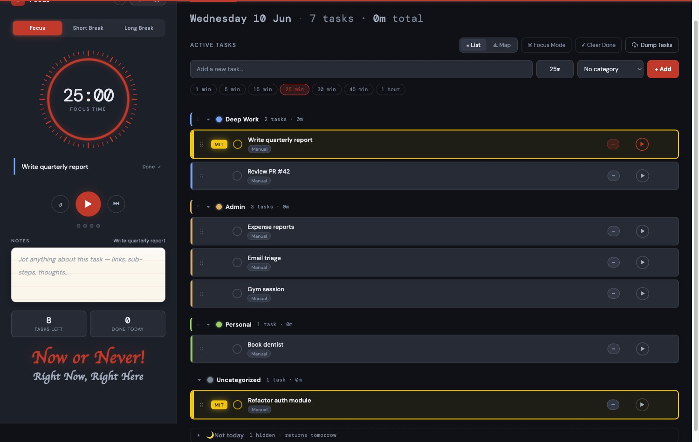

# ⛰ Focus Timer — the ADHD-first focus app with a map for your mind

**Your tasks, twice:** a ruthless execution list for *doing*, and a hand-drawn mountain map for *thinking*.

**[▶ Open the app](https://uiyonkimapac.github.io/focus-timer/)** — free, no account, installs to your home screen, works offline.

---

## Why another timer?

Most productivity apps are built for brains that already remember things. Focus Timer is built for brains that don't — every screen is designed to **hold your working memory for you** and make the next action one tap away.

- **Dump first, sort later.** Brain-dump a wall of text into tasks in seconds. Get it out of your head before it evaporates.
- **One Most Important Task.** Mark your MIT and it turns golden — on the list *and* as a snow-capped golden peak on the map. You always know what matters.
- **"Not today" without guilt.** Snooze a task and it mists out instead of disappearing — object permanence for tasks. It returns tomorrow automatically. Snooze it three days running and it earns a red **FACE IT!** badge. The app keeps you honest.
- **An 8-hour reality check.** Plan more than a workday and the map quietly tints the overflow. No nagging — just a signal.
- **Routines that come back on their own.** Mark a task ↻ daily, weekdays, or weekly and it returns fresh on schedule after you finish it — one task, never a pile-up of missed days.

## Two views, one brain

### ≡ List — for execution
A classic, fast task list: color-coded categories with time roll-ups, a minutes picker, per-task notes, drag to reorder (finger or mouse), one-tap start. A built-in Pomodoro timer (25/5/15) with session dots, sounds, and a Focus Mode that hides everything but the task at hand. Hit **⟳ Run** to work your list as a guided full-screen session — build or save named **routines** (Routinery-style) with per-gap breaks, and when time's up the clock holds in **overtime** until *you* call it done. A three-card glance keeps the day honest — **Focused** (minutes today), **Remaining** (time still on the list), and **Done** (tasks completed).

### ⛰ Map — for thinking
The **Mountain Board**: every task is an etched line-art peak. Size = time. Left-to-right = duration along an hour ruler. Up = priority. Categories are mountain *ranges* with serif territory names, like an old cartographer drew your day. The map **fills your whole screen, edge to edge** — no wasted margins — and re-fits when you resize or rotate.

Drag peaks around to plan spatially. Stack them close — above, below, or beside a range — and they join that category. Drop one mountain onto another to group them. Drag a peak to the trash, or to the copy zone to duplicate. Pinch, pan, zoom from 100% (the whole map) to 400%. It's not a chart — it's a map of your intentions.

*Dark theme is ink on slate; light theme is sepia on parchment.*

## Everywhere you are

- **📱 Install it** — Add to Home Screen on iOS/Android and it runs fullscreen like a native app.
- **✈️ Offline-first** — everything (even the sounds) works with no connection. Your data lives on your device.
- **🔄 Realtime sync (optional)** — enter one sync code on every device and tasks flow between them live.
- **🎛 Remote control** — with sync on, start, pause, or reset the timer on any other device from the one in your hand. Your phone becomes the remote for your desk.
- **💾 Own your data** — export a formatted HTML report of tasks, completions, and focus stats anytime.

## The fine print that isn't fine print

- Single HTML file. No build, no framework, no tracker, no account.
- Free and open. Fork it, remix it, make it yours.

**[Start now →](https://uiyonkimapac.github.io/focus-timer/)** · [User Manual](docs/USER-MANUAL.md)
